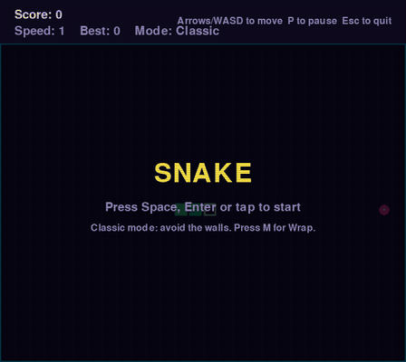

# Snake

[](https://github.com/rishabhrayy/snake-game/actions/workflows/ci.yml) [](https://snake.rishabhray.me) [](LICENSE)

Classic Snake in Python and Pygame, with a neon arcade look - and the same code runs in your browser, compiled to WebAssembly.

**[Play it in your browser](https://snake.rishabhray.me)** - arrows, WASD, or swipe on a phone.



## Features

- Smooth grid movement that speeds up as you eat, with a no-instant-reverse guard
- **Two modes**: Classic (walls kill) and Wrap (walls wrap around to the other side). Press M, or swipe sideways on a phone, between games
- **A best score that survives restarts**, kept per mode: in a small JSON file on desktop, in `localStorage` in the browser. A corrupt save just starts from zero
- **Buffered turns**: two keys pressed faster than the snake moves (a quick up-then-left U-turn) are both kept, and each is checked against the one before it, so you can never reverse into yourself
- Start, pause, game over, new best and win screens
- Keyboard (arrows or WASD) and touch (swipe to steer, tap to start)
- Neon arcade palette, pixel-square segments and a CRT scanline overlay
- One codebase for desktop and web: the main loop is `async` and yields to the browser every frame, which is what lets [pygbag](https://github.com/pygame-web/pygbag) run it as WebAssembly

## Run on the desktop

```bash
python -m pip install -r requirements.txt
python src/main.py
```

(With MSYS2 Python, install Pygame with `pacman -S mingw-w64-x86_64-python-pygame` instead.)

## Build for the web

```bash
python scripts/build_web.py        # pygbag compiles src/ and copies it into site/game/
python -m http.server 8000 --directory site   # then open http://localhost:8000
```

`site/index.html` is the arcade-cabinet page that frames the game.

## Tests and the demo GIF

```bash
python -m pytest -q                # 17 tests on the game logic, run headless
python scripts/record_demo.py      # re-records assets/demo.gif
```

The GIF is recorded by an autopilot that plays the real game headlessly: a breadth-first search finds the shortest safe path to the food each move.

## Controls

| Action | Keyboard | Touch |
|---|---|---|
| Move | Arrows or WASD | Swipe |
| Start / restart | Space or Enter | Tap |
| Switch mode (between games) | M | Swipe sideways |
| Pause / resume | P | - |
| Quit (desktop only) | Esc | - |

## Design notes

- **Logic and drawing are separate.** `update()` moves the snake and decides the outcome; `draw()` only reads state. That is what lets the tests drive whole games without a window, and the GIF recorder play headlessly.
- **One loop, two platforms.** The only web-specific code is the `async` main loop and the save location; pygbag's `platform.window` gives Python direct access to the browser's `localStorage`.

## Licence

[MIT](LICENSE)
